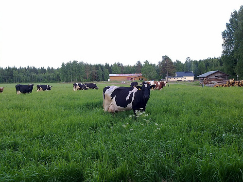

# jquery.caro - Simple, scaleable carousel for jQuery

Why we need yet another carousel plugin? Simply because I couldn't find one that fits my purposes. As a result caro.js was born. It does one thing better than the others, it scales according to your layout.

## Features

* Horizontal, vertical scrolling
* Playback mode
* Recursive carousels. You can define carousels inside your carousels

## Example

`caro` relies on a minimal amount of configuration. Most of the magic happens at HTML:

```html
<div class="carouselDemo">
    <div class="buttons">
        <a href="#" class="first button">first</a>
        <a href="#" class="previous button">left</a>
        <a href="#" class="last button">last</a>
        <a href="#" class="next button">right</a>
    </div>
    <div class="slides">
        <div>
            
        </div>
        <div>
            
        </div>
        <div>
            
        </div>
        <div>
            
        </div>
        <div>
            
        </div>
    </div>
    <div class="navigation"></div>
</div>
```

If you want to add playback controls, you would do something like this:

```html
<div class="carouselDemo">
    <div class="buttons">
        <a href="#" class="play button">play</a>
        <a href="#" class="stop button">stop</a>
    </div>
    <div class="slides">
        ...
    </div>
</div>
```

You can mix and match definitions as you like. Furthermore you can include definitions within definitions. For instance a slide could contain an entire carousel within itself and it would still work.

## Known Glitches

Do not apply `border` to slides directly. This will break internal logic. If you need to apply border per slide, create an inner element instead and apply your rule on that. Ie.

```html
...
    <div class="slide">
        <div class="slide-wrapper">
        </div>
    </div>
```

See #7. It might be possible to fix the issue at the plugin itself but no solution has presented itself yet.

## License

MIT.
